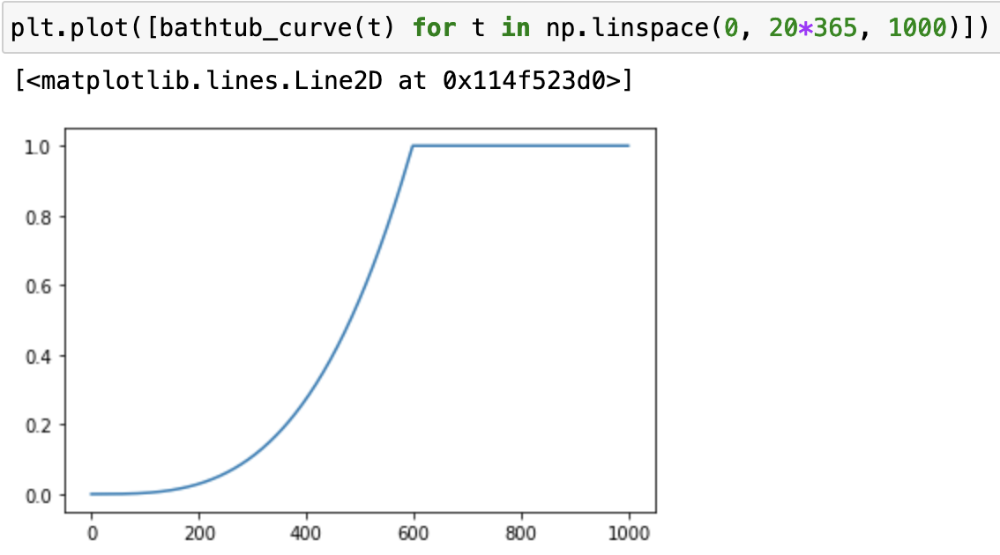
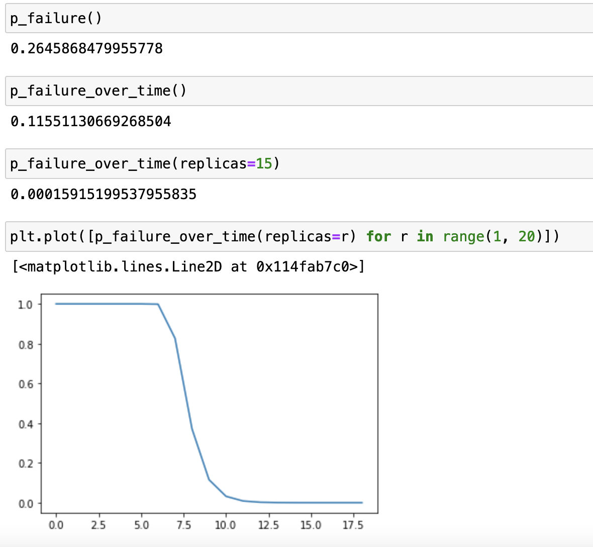

# ANS-107: Succinct Proofs of Random Access 1.1

Status: Draft

Authors: Sam Williams sam@arweave.org, @vird <virdvip@gmail.com>, Lev Berman ldmberman@protonmail.com

## Abstract

This document describes the new iteration of the consensus mechanism for the Arweave network.

## Motivation

The new design aims to increase the amount of data the network stores under the
given economic conditions and, at the same time, minimize the energy
expenditure for the same amount of money invested. It is important to stress that, these two
goals might conflict as the cheapest storage capacity does not necessarily
come together with the lowest energy consumption. Thus the goal is to strike
a reasonable balance between the two and at the same time satisfy the following:

- Make sure trading storage for computation is significantly less
cost-efficient approach to mining.
- Incentivize storage with sufficiently large IOPs and bandwidth.

The second condition affects the data read and write throughput of the network. The first condition also influences the write throughput,
as the cost of computing a replica is in line with the time the computation
takes. It is important to note that, the total pace at which the network can accept
data, scales linearly with the number of public nodes receiving data.

After evaluating the cost-efficiency and the energy-efficiency of various hardware
setups and multiple configurations of the devised protocol, we agreed upon the parameters that make the commonly available SATA hard drives most optimal for
the Arweave mining. SSDs, while being more energy-efficient, are still significantly
more expensive. However, some people [speculate](https://3zr4jmy5uux4n5rozidr7cp2w2qyyuwku32oxazzz4qwvbw6j3na.arweave.net/3mPEsx2lL8b2LsoHH4n6tqGMUsqm9OuDOc8haobeTto) that their price is trending towards their
cheaper storage medium competitor. If it becomes true, they would also become the preferrable
storage medium for Arweave miners, and the network's energy footprint per invested dollar may drop.
We also find the hard drive IOPs and bandwidth viable for the Arweave needs. In contrast,
we would probably go for the magnetic tape if we were not concerned with the network read
and write throughputs.

Additionally, the new design improves pricing by continuously adjusting the price per gigabyte based on the past network performance. Essentially, the network is an oracle
of its maintenance costs. The upgrade is justified by the improved
precision of estimating the number of stored replicas from the network difficulty as
the mining efficiency is now stronger coupled with the number of replicas.

## Approach

### Rationale

Intuitively, to maximize the total number of replicas in the network, we need
to make the winning chances in the mining competition mainly depend on the
number of stored replicas for each miner. At the same time, we want
the mining process to be computationally cheap. An obvious yet impractical
approach would be to take the current version of SPoRA and use a fast hashing
function (e.g., SHA2-256) to pick a chunk of data and perform the difficulty
check. If we do this, miners will trade space for energy by grinding -
computing an excess of hashes to find those that point to the available subset
of the weave. Fundamentally, grinding relies
on the practically infinite number of nonces, each pointing to a chunk of data.
A logical next step would be to reduce the number of nonces eligible for
mining. Suppose, the number of available nonces are limited, and one can almost
instantly compute the corresponding amount of hashes on average commodity
hardware - in this case, there is no benefit in grinding. The competition is
then based exclusively on the speed of access to data. However, a new issue
arises - the number of nonces might be too small to keep miners running for the
time required to maintain the two-minute block time. Worse, any chosen number
of nonces sufficiently large to avoid grinding becomes insufficiently large
once the network scales horizontally (more miners join the network) or
vertically (by introducing bigger-bandwidth access lanes). We may make nonces
specific to mining addresses to resolve the horizontal scaling issue; however,
this re-introduces grinding in the form of searching through the nonces of many
different mining addresses at once. To avoid this, we can make the entire
replicas specific to mining addresses. When adding more addresses, miners would
necessarily expend proportionally more energy to prepare more replicas and
allocate proportionally more storage to store them. To address the problem of
the limited amount of nonces per address, we only reduce the number of nonces
available in a time frame. Finally, we need to tune nonce throttling to make
miners prefer redundant storage over too expensive storage and at the same time
strike an optimal balance on the storage-computation-cost trade-off.

On a high level, the new mining process goes as follows:

1. A miner creates a mining key and a replica of the dataset specific to this key.
2. The miner unlocks nonces, a very limited amount at a time.
3. The miner reads portions of the dataset pointed to by the unlocked nonces and checks
them for solving the mining puzzle.

### Creating Mining Address-Specific Replicas

To create unique replicas, we leverage packing introduced in Arweave 2.5. Every packed chunk
is unique per dataset offset (the same chunk placed at different offsets has different packing).
In this iteration, we make packing unique per mining address as well.

### Throttling Nonces

To make miners prefer investments into redundant storage over expensive
storage, we cap the performance of a single mining address-bound dataset by
unlocking only so many nonces per time frame per instance. We call a process
unlocking a single series of nonces "nonce limiter." Technically, we make
miners perform a nonparallelizable computation with predictable execution time.
The calculation must not be accelerated significantly, e.g., using dedicated
hardware; for prevention, we use three different functions to construct a nonce
limiter - two computations are performed in parallel so that to speed up
nonce limiting, one would need to speed up all three computations accordingly.
We adjust the computation difficulty based on the past performance so that
if somehow all three functions are accelerated, they keep unlocking the same number of
nonces per time frame. The primary motivation is to keep the network difficulty
closely approximating the total number of replicas which is in turn used in
pricing.

We construct a nonce limiter from the SHA-256 and [RandomX](https://github.com/ArweaveTeam/RandomX/tree/arweave-v1.1.7) cryptographic hash functions. The modern processors have special circuits for computing SHA-256 quickly,
leaving little room for potential acceleration (the subject has been previously
explored by the [Solana](https://hxs2q5ioasadv2sgcc4kgyouso5zxnyimoqvvtw2w2jd6pgqdzcq.arweave.net/PeWodQ4EgDrqRhC4o2HUk7ubtwhjoVrO2raSPzzQHkU) and [Filecoin](https://hy2crkkmsqolvhjmcn7q6g37evosrb7dguvqvgih65ut5cab5xta.arweave.net/PjQoqUyUHLqdLBN_Dxt_JV0oh-M1KwqZB_dpPogB7eY) teams).

The acceleration potential is why we do not just go for a verifiable delay function that,
although attractive for much faster verification, is very prone to significant acceleration
on FPGAs. Therefore, a consequence we have to deal with is more time-consuming block validation.
We deal with it by making the validation “optimistic” - the miners perform quick partial
verification to gain some confidence the block is valid and start mining on it while at the same
time validating the rest in the random order. To strengthen the approach, we implement
the notification system where a miner who discovered an invalid part of the hash chain notifies
the rest of the network. The nonce limiter is akin to the Timelord in Chia. In theory, it may be
computed by a single entity trusted by the entire network. Miners secure the system by allocating
a small number of resources to validating random parts of the hash chain along with the
notification system mentioned earlier. Therefore, with a low individual cost, the miners increase
the probability of discovering the disappearance or malice of the shared nonce production early. They remedy it by
either switching to other sources of nonces or falling back to computing them. Running a nonce
limiter also reduces the burden of validating nonce limiter outputs as the entire network uses
the same hash chain, unless there are forks.

To make reading chunks pointed to by nonces from HDDs efficient, we make the nonce limiters
unlock contiguous intervals of space we call "recall spaces" (`RECALL_SPACE_SIZE` in the
protocol parameters table and pseudocode further in this doc). Once yet another nonce
throttling hash is computed, several recall spaces are unlocked where the beginning of
each such space is determined pseudorandomly by combining the hash with the mining address and
the sequence number of a particular recall space and taking a remainder of the integer division of
the hash by the weave size. A set of chunks spaced by 256 KiB sections following the beginning
of the unlocked recall space are checked for solving the mining puzzle.

The number of unlocked nonces per time frame has to scale with the weave growth to keep the hashrate
cost constant. Otherwise, the on-demand packing, whose efficiency does not depend on the
nonce unlocking (due to mining address grinding), eventually becomes cheaper than honest mining.
Technically, we split the weave into fixed areas we call "search spaces"
of the size `SEARCH_SPACE_SIZE` - a recall space is unlocked every second in each search space
for each mining address.

##### Data Distribution

The mining algorithm has to incentivize miners to construct complete replicas to make the data
distribution in the network uniform. There has to be a strong preference for a single entire replica
over a part of it replicated several times with the same total volume. To introduce this incentive,
we implement the following model: we make each recall space consist of two parts - one chosen
from one of the corresponding search spaces, the other - from anywhere in
the weave. We map every offset (we only consider offsets 256 KiB apart from each other) from the
first area to the corresponding offset in the second area. The first area provides solution
candidates as-is, whereas chunks from the second area only serve as nonces when combined with
the related chunks from the first area. Considering an equal split, miners not replicating the
entire weave lose up to 50% of the performance from the corresponding replicas.

Considering the above, miners need to read at least one (when two parts of the recall space intersect)
and at most four (each of the non-intersecting parts begins near the end of the corresponding search space
in which case it continues back at the beginning of the space) continuous data intervals from disk
per search space per mining address. The IOPs of the hard drives are sufficient for that.

Although the incentive is now in place to assemble complete replicas, we cannot expect the data
distribution to be perfectly uniform at all times due to occasional fatal disk failures and
the miners’ turnover. Therefore, we set the number of replications every
transaction has to pay for high enough to create enough redundancy for avoiding statistical data loss.

Another potential cause of an uneven distribution is small miners who cannot afford to store
the entire weave. These miners would benefit from joining forces in a pool. To enable that,
we combine the chunks from two different recall space parts via an intermediate hash which
can be passed on to another node.

<details>
  <summary><b>Nonce Limiter Pseudocode</b></summary>

```
  // prevNonceLimiterOutput is the final output of the nonce limiter from the previous block.
  // prevNonceLimiterOutput is empty for the first 2.6 block.
  // shaIterations, randomXIterations and VDFTime are the three components
  // determining the time it takes to compute every nonce limiter output.
  INPUT prevNonceLimiterOutput, prevSolutionHash, shaIterations, rxIterations, VDFTime

  SET iteration to 0
  CALL sha256 with the concatenation of prevNonceLimiterOutput and prevSolutionHash RETURNING initialSeed
  SET seed to initialSeed
  LOOP
    CALL sha256 with seed RETURNING h
    SET seed to h
    SET iteration to iteration + 1
    IF iteration == shaIterations THEN
	BREAK
    ENDIF
  ENDLOOP

  // In practice, the two loops and the VDF function are computed in parallel.
  SET iteration to 0
  SET seed to initialSeed
  LOOP
    CALL randomX with seed RETURNING rh // Arweave 2.5 RandomX
    SET seed to rh
    SET iteration to iteration + 1
    IF iteration == rxIterations THEN
        BREAK
    ENDIF
  ENDLOOP

  CALL VDF with initialSeed, VDFTime RETURNING VDFOutput
  CALL sha256 with the concatenation of h, rh, and VDFOutput RETURNING nonceLimiterOutput
  RETURN nonceLimiterOutput
```
</details>

<details>
  <summary><b>Determining Recall Space First Part Start Pseudocode</b></summary>

```
  // miningAddress is the SHA-256 hash of the miner's public key (ECDSA or EDDSA).
  // searchSpaceSeqNumber >= 1; =< intever division of weaveSize by SEARCH_SPACE_SIZE.
  // prevSolutionHash is the solution hash of the previous block.
  INPUT miningAddress, nonceLimiterOutput, searchSpaceSpaceSeqNumber, prevSolutionHash

  CALL sha256 with the concatenation of nonceLimiterOutput, searchSpaceSeqNumber, prevSolutionHash, and miningAddress RETURNING h0
  SET searchSpaceStart to integer division of h0 by searchSpace
  RETURN searchSpaceSize * (searchSpaceSeqNumber - 1) + searchSpaceStart
```
</details>

<details>
  <summary><b>Determining Recall Space Second Part Start Pseudocode</b></summary>

```
  // miningAddress is the SHA-256 hash of the miner's public key (ECDSA or EDDSA).
  // weaveSize is taken from the 50th most recent block.
  // searchSpaceSeqNumber >= 1; =< intever division of weaveSize by SEARCH_SPACE_SIZE.
  // prevSolutionHash is the solution hash of the previous block.
  INPUT miningAddress, nonceLimiterOutput, searchSpaceSpaceSeqNumber, prevSolutionHash, weaveSize

  CALL sha256 with the concatenation of nonceLimiterOutput, searchSpaceSeqNumber, prevSolutionHash, and miningAddress RETURNING h0

  RETURN integer division of h0 by weaveSize
```
</details>

### Quantifying Trade-offs

We have made a calculator exploring the trade-offs, suggesting
the choices for the protocol parameters
(recall space size, search space size, packing difficulty) to make the prescribed mining
scheme the most economically viable.

[Link](http://arweave.net/_0mCy51JjFIHDfks5KF4mR6y4mqj8woWWzGKt7Mgd04), [Source](../2_6_unit_cost_calculator.html).

The calculator compares the unit costs of various modes of mining. The unit cost is the cost
of a single attempt at finding a block, one  "mining lottery ticket."

The four trade-offs considered are:

1. **Storing Data vs. On-Demand Packing**

    A possibility suggested by the computation-storage-cost trade-off is an
    alternative mining scheme where a miner stores a single raw replica
    of the dataset, scans the nonces of a large quantity of mining addresses
    at once, and computes the replica-specific representations (packing) of the
    chunks at the moment of checking them for solving the mining puzzle.
    We call it “on-demand packing.”

    The calculator compares the computation costs incurred by repeated packing
    with the costs of storing the data packed in advance
    ("On-Demand Cost / Honest Cost").

2. **Energy Expenditure vs. On-Demand Packing**

    The mining investments going into paying for electricity versus the
    investments into hardware, "2.6 Unit Consumption Cost Share" compared
    with Arweave 2.5 "2.5 Unit Consumption Cost Share".

3. **Write Speed vs. On-Demand Packing**

    The on-demand packing costs multiplier vs. the speed of packing.
    See "On-Demand CPU Packs TiB/day" and "On-Demand Cost / Honest Cost."

4. **Storage Capacity vs. Bandwidth**

    See "Honest SSD Costs / Honest HDD Costs."

The assumptions made:

- one can combine an arbitrary amount of storage with a required quantity of the computation power;
in practice, mining costs should be slightly higher due to some excess storage capacity or CPU
power;
- the packing costs are not accounted for in the estimation of the honest mining costs because
every chunk is only packed once and can then be moved indefinitely from disk to disk;
- on-demand miners can cooperate among themselves and with honest miners so they do not
even have to buy storage and simply keep chunks in the L3 cache - in this case, they either have to find
a sufficiently large pool capable of saturating their mining capacity or launch a sufficiently large mining farm;
- although the comparisons are made for the "unit" costs (per chunk), the estimations are based on the prices of the specific hardware; we considered a few other hardware options which lead to similar unit costs;
- the calculations do not depend on the weave size, however, it does not make sense to have the search space size
smaller than the weave size.

Notes:

- "Additional Costs" mainly include the motherboard and RAM for both the on-demand packing CPU
and honest mining processor;
- "Chunk Processing Rate" of the honest mining CPU estimates how many chunks can a single processor process
considering they (chunks) are read from several disks, and sha256 over each of them is computed.

### Deterministic And Nondeterministic Chains

Since the protocol aims to limit the number of nonces any single mining instance has at its
disposal at any point in time, we have to exclude nondeterministic block data (like transactions)
from the mining puzzle. Therefore, we need a new way to attach transaction data to the
deterministic chain of solutions. To achieve that, we require miners to sign block data with
every mining solution and the signatures of several previous blocks.

### Adaptive Pricing

To make pricing adaptive, we rely on the fact the Arweave protocol is essentially a decentralized
oracle for the costs of its own maintenance. Once there is a history of the mining income received
and the corresponding service provided, the protocol can react to changes of either the mining
income or the provided service and adjust both the payment to the miners and the prices for the users (transaction
fees).

The mining income consists of three parts:

</img>.

The inflation reward is there to bootstrap the economy, halving every year:

</img>

The only component in this formula the protocol can control is the endowment reward paid out from
the endowment pool. The endowment is a reserve fund - we only take from it if the inflation and
the transaction fees do not cover the estimated costs of maintaining a certain minimal number of
the weave replicas - "TARGET_REPLICA_COUNT." The actual replica count corresponding to a block
can be computed as:

</img>, where

</img>,

</img>,

</img>.

Now, let us use the protocol as an oracle and consult its history to estimate the price of storing a replica per block:

</img>.

Any changes in the mining income are expected to cause proportional changes in the replica
count as miners adjust to the new profitability of the game. The time window requires to be
sufficiently large to keep the price in USD constant. Also, we use the median as a target metric because it better absorbs temporary fluctuations in price.

Next, we assume a 0.5% yearly decline rate for the entire cost of maintaining a replica. This very conservative rate gives us decades for the related technological advances to occur and
reduce the costs before the endowment fund runs low.

</img>.

Considering 20% of what is paid to the endowment goes to the miner as an incentive for including
the transaction:

</img>.

Now we can go back to the first equation and determine the endowment reward necessary to compensate
the network for storing the target number of replicas:

</img>

In the beginning, the new protocol does not have sufficient statistics, so it has to be bootstrapped
with some reasonable initial values - we will use the current pricing scheme from Arweave 2.5.
We will program the new rules to activate in 18 months to have enough time to monitor the
new protocol before the pricing changes kick in.

### Target Replica Count

The target replica count is the minimal number of data copies users must pay for during every upload.
We want to keep it small to offer a cheaper pricing plan (on top of that, there is an option of
repeatedly submitting the same data to increase the replication count further). At the same time,
we want it to be sufficiently large to avoid accidental data loss.

We anticipate hard drive failures to be the largest cause of lost replicas. To choose the target,
we need to come up with reasonable yet conservative leaning assumptions about the
reliability of the disks and the maintenance patterns and select the target so that it is highly
likely at least one replica survives during a reasonable long time.

The main inputs for our model are the hard drives' failure rates depending on their age, the ages
of the drives storing a particular piece of data and the expected response to failures. Essentially,
we are looking for the probability of an event when all disks storing the considered copies
fail around the same time.

To estimate hard drives' failure rates, we use the reports published by
[Backblaze](https://55rqrqybicnun6rdcynuo2dwpy554hoxvn4nq7njwmcofpul6yma.arweave.net/72MIwwFAm0b6IxYbR2h2fjveHdereNh9qbME4r6L9hg) - the study includes data from over 200,000 disk drives, many of which have
survived six years or longer.

We make the following conservative assumptions:

- once a drive fails, the miner replaces it and re-syncs the data in 14 days;
- all disks in the system are older than four years.

We infer [the bathtub curve](https://k7kc6gfbacbwlke3fn3ee6qbpwzsjk5sn6tzhr7kkhc6gpqzyrwq.arweave.net/V9QvGKEAg2Womyt2QnoBfbMkq7Jvp5PH6lHF4z4ZxG0) from the Backblaze data - the function determines the disk's failure
rate based on its age. We are using day precision here.

```
def bathtub_curve(t):
    p = np.log(0.06/0.108) / np.log(5/6)
    alpha = 0.06 / (5 * 365) ** p
    return min(1, alpha * np.power(t, p))
```



The system is modelled by the ergodic [Markov chain](https://77hbrx237yz6zoyyfypffprankqxwt5x3wg6pggvulzrovqvwtga.arweave.net/_84Y31v-M-y7GC4eUr4gaqF7T7fdjeeY1aLzF1YVtMw) where each of the possible disk's ages is a
state, and the failure rate function determines the transition probabilities.. The first 14
states are used to model the time when the disk is not replaced after a failure.

The transition matrix is computed as follows:

```
def get_transition_matrix():
    ages = range(365*4, 4368)  # We assume the disk fails before the age of 4368 days.
    failure_probabilities = np.array([0] * 14 + [bathtub_curve(w) for w in ages])
    n = failure_probabilities.shape[0] + 1
    A = np.zeros(shape=(n, n))
    for i in range(n - 1):
        A[0, i] = failure_probabilities[i]  # P(i -> 0)
        A[i + 1, i] = 1 - failure_probabilities[i]  # P(i -> i + 1)
    # Assuming that n-week old are always going to fail.
    A[0, n - 1] = 1
    return A
```

Every ergodic Markov chain has a unique [stationary distribution](https://h75gfvulpibxrabchwhuosgncrevgnl4tpzjm634bwfwpjmq3gnq.arweave.net/P_pi1ot6A3iAIj2PR0jNFElTNXyb8pZ7fA2LZ6WQ2Zs). In our case, the stationary
distribution is treated as the probabilities of finding a specific piece of data in
the possible states (failed 14 days ago, failed 13 days ago, .. lives one day, lives two days, etc.).

```
def get_stationary_distribution():
    A = get_transition_matrix()
    eign_values, eign_vectors = np.linalg.eig(A)
    eign_value_one_count = 0
    for eign_val in eign_values:
        if np.abs(np.real(eign_val) - 1) < 1e-12:
            eign_value_one_count += 1
    assert eign_value_one_count == 1
    stationary_indx = np.argmin(np.square(np.abs(eign_values - 1)))
    eign_vector = eign_vectors[:, stationary_indx]
    normalized_eign_vector = eign_vector / np.sum(eign_vector)
    stationary_distribution = normalized_eign_vector
    assert np.imag(eign_values[stationary_indx]) < 1e-12
    assert np.abs(np.real(eign_values[stationary_indx]) - 1) < 1e-12
    assert np.sum(np.abs(np.imag(stationary_distribution))) < 1e-12
    stationary_distribution = np.real(stationary_distribution)
    return stationary_distribution
```

To compute the final estimation, we sum up the probabilities of all of the considered replicas find
themselves in one of the failed states on the same day for all days of the 200 years period.

```
def p_failure():
    n = 14
    p = 0
    while n:
        p += (1 - p) * stationary_distribution[n]
        n -= 1
    return p

def p_failure_over_time(days=200*365, replicas=10):
    p_f = p_failure() ** replicas
    p = 0
    while days:
        p += (1 - p) * p_f
        days -= 1
    return p
```



We choose 15 replicas as a target.

### Gradual Migration

To ensure a smooth transition to the hard drive-dominated mining, we will launch the new network
with the high value for RECALL_SPACE_SIZE advantageous for SSD mining and slowly tuning it down.

### Protocol Parameters

| Parameter                     | Initial                                                    | Eventual       | Rationale  |
|-------------------------------|------------------------------------------------------------|----------------|------------|
| TARGET_REPLICA_COUNT          | 15                                                         | 15             | The number of replicas every upload must pay for. Chosen so that the probability the uploaded data is lost in 200 years is low under a number of relatively conservative assumptions about how miners maintain storage.
| SEARCH_SPACE_SIZE   | 4 TiB                                                      | 4 TiB          | The weave size divided by RECALL_SPACE_SIZE. Strikes a reasonable balance between the on-demand packing safety margin and the benefit of faster storage.
| SINGLE_CHUNK_SOLUTIONS_SHARE  | 50%                                                        | 50%            | The percentage of solution candidates that only require a single chunk as opposed to two chunks. It also determines the proportions of recall space splits during mining. Determines the “punishment” for creating a new replica before completing the current one.
| RECALL_SPACE_SIZE             | 8000 MiB                                                   | 200 MiB        | The size of one of the SEARCH_SPACE_SIZE areas unlocked per mining address every second. Initially giving SSD miners an advantage, eventually comparable with sequential read bandwidth of an ordinary hard drive.
| TRANSITION_PERIOD             | 6 months                                                   |                | The time it takes until RECALL_SPACE_SIZE reaches its end value. The transition is linear.
| NONCE_UNLOCK_INTERVAL         | 1 second                                                   | 1 second            | The frequency of unlocking the groups of nonces. Comparable with the block propagation time and small compared to the block time so that the gain from processing an unlocked group of nonces much faster (e.g., using a NVMe SSD) is small. Two areas of the size RECALL_SPACE_SIZE are unlocked.
| INITIAL_NONCE_LIMITER_DIFF    |                                                            |                     | The difficulty of the nonce limiting computation. Chosen so that all nonce limiting functions take a second to execute on the best available hardware for each of them.
| NONCE_LIMITER_CHECKPOINTS     | 1000                                                       | 1000           | The number of nonce outputs excluding the last unlocked interval, evenly spread out.
| LAST_UNLOCK_INTERVAL_NONCE_LIMITER_CHECKPOINTS | 10                                        | 10             | The number of nonce outputs from the last unclocked interval, evenly spread out.
| PACKING_DIFFICULTY            | 30                                                         | 30             | The difficulty of packing a chunk. RandomX iterations per chunk or 30 * 8 RandomX programs. Strikes a reasonable balance between the on-demand packing safety margin and the volume of data a miner can pack in a day. 16-core AMD Epyc 7313 packs about 20.5 TiB in a day.
| HISTORICAL_PRICES_SAMPLE_SIZE | 30\*24\*365                                                | 30\*24\*365    | The number of blocks providing data points for the calculation of the PGBB (price per gigabyte per block). One year's worth of data.

## Additional Pseudocode

<details>
  <summary><b>Mining</b></summary>

```
  // The non-deterministic block fields are timestamp, last_retarget, diff, cumulative_diff,
  // txs, tx_root, hash_list_merkle, wallet_list (the accounts patricia tree root), block_size,
  // weave_size, tags, usd_to_ar_rate, scheduled_usd_to_ar_rate, reward_pool, previous_block,
  // conflicting_signatures.
  //
  // The deterministic block fields are search_space, nonce (chunk number), nonce_limiter_outputs,
  // nonce_limiter_len, previous_solution_hash, hash (h1), height, mining_key,
  // poa (chunk, data_path, tx_path), poa2, packing_2_5_threshold, packing_2_6_threshold,
  // strict_data_split_threshold.
  //
  // The block identifier (indep_hash) is the SHA384 hash of the signature.
  //
  // blockReceipt is a collection of only non-deterministic block fields.
  //
  // miningAddressPrivateKey is an ECDSA secp256k1 or an EDDSA ed25519 key;
  //
  // weaveSize is taken from the 50th previous block.
  INPUT miningAddressPrivateKey, miningAddressPublicKey, prevSolutionHash, diff,
	searchSpaceNumber, nonceLimiterOutput, weaveSize

  CALL sha256 with miningAddressPublicKey RETURNING miningAddress
  SET recallSpaceFirstPartStart to the absolute offset of the beginning of the first recall space part inferred from searchSpaceNumber, miningAddress, nonceLimiterOutput, and prevSolutionHash
  SET recallSpaceSecondPartStart to the absolute offset of the beginning of the second recall space part inferred from searchSpaceNumber, miningAddress, nonceLimiterOutput, weaveSize, and prevSolutionHash

  pre-read the RECALL_SPACE_SIZE * SINGLE_CHUNK_SOLUTIONS_SHARE bytes starting at recallSpaceFirstPartStart; if the search space ends before all bytes are read, continue from the beginning
  pre-read the RECALL_SPACE_SIZE * (1 - SINGLE_CHUNK_SOLUTIONS_SHARE) bytes starting at recallSpaceSecondPartStart; if the search space ends before all bytes are read, continue from the beginning

  CALL sha256 with the concatenation of nonceLimiterOutput, searchSpaceNumber, prevSolutionHash, and miningAddress RETURNING h0
  SET nonce to 1
  LOOP
    SET totalNonces to integer division of RECALL_SPACE_SIZE by CHUNK_SIZE
    IF nonce > totalNonces THEN
       // We have tried all the nonces for the given nonceLimiterOutput and searchSpace.
      RETURN
    ENDIF
    IF nonce =< totalNonces / 2 THEN
      SET offset to recallSpaceFirstPartStart + (nonce - 1) * CHUNK_SIZE + 1
      IF the chunk containing the offset is not among the pre-read chunks THEN
        SET nonce to nonce + 1
        CONTINUE
      ELSE
        SET h1Preimage to the concatenation of chunk, h0, nonce, miningAddress
        CALL sha256 with h1Preimage RETURNING h1
        IF h1 =< difficulty THEN
          SET nonce to nonce + 1
          CONTINUE
        ENDIF
      ENDIF
    ELSE
      SET twoChunkNonce to the remainder of integer of nonce by totalNonces
      SET offset to recallSpaceFirstPartStart + (twoChunkNonce - 1) * CHUNK_SIZE + 1
      SET secondOffset to recallSpaceSecondPartStart + (twoChunkNonce - 1) * CHUNK_SIZE + 1
      IF the chunk containing the offset is not among the pre-read chunks THEN
        SET nonce to nonce + 1
        CONTINUE
      ENDIF
      IF the chunk containing the second offset is not among the pre-read chunks THEN
        SET nonce to nonce + 1
        CONTINUE
      ENDIF
      CALL sha256 with the concatenation of chunk, h0, nonce, miningAddress RETURNING h
      SET h1Preimage to the concatenation of h, second chunk
      CALL sha256 with h1Preimage RETURNING h1
      IF h1 =< difficulty THEN
        SET nonce to nonce + 1
        CONTINUE
      ENDIF
    ENDIF

    read the Merkle proof(s) of inclusion for the chunk(s)
    SET timestamp to current POSIX time in seconds
    collect NONCE_LIMITER_CHECKPOINTS evenly spaced nonce limiter outputs and LAST_UNLOCK_INTERVAL_NONCE_LIMITER_CHECKPOINTS nonce limiter outputs from the last unlocked interval into nonceLimiterOutputs
    construct signaturePreimage from h1, timestamp, and other block fields not included in h1
    sign the signaturePreimage with miningAddressPrivateKey RETURNING signature
    dispatch the new block to peers
    RETURN
  ENDLOOP
```
</details>

<details>
  <summary><b>Block Gossip</b></summary>

```
  // For the given block candidate, find the parent block in the block cache,
  // verify the signature, assert the chunk(s) are chosen correctly considering the
  // mining key, validate the initial part of the hash chain in parallel with
  // LAST_UNLOCK_INTERVAL_NONCE_LIMITER_CHECKPOINTS cores. If the function successfully
  // validates the block candidate, we can add it to the block cache and start mining on it
  // in case it is the tip of the longest chain.

  // weaveSize is the weave size of the 50th previous block.
  INPUT // Received from the miner:
        chunk, inclusionProof, chunk2, inclusionProof2, nonce, h1, prevSolutionHash,
        searchSpaceNumber, nonceLimiterOutputs, timestamp, diff, miningAddressPublicKey,
        // Not received:
        blockCache, txRootOffsets, weaveSize

  CALL sha256 with miningAddressPublicKey RETURNING miningAddress

  IF previousBlock is not found in blockCache THEN
    RETURN
  ENDIF
  take previousBlock from blockCache
  IF prevSolutionHash does not match h1 of previousBlock THEN
    ban IP
    RETURN
  ENDIF

  IF timestamp is smaller than previousBlock's timestamp by more than the allowed difference THEN
    ban IP
    RETURN
  ENDIF
  IF timestamp is not within an acceptable window THEN
    RETURN
  ENDIF
  IF diff is not a correct difficulty according to the retarget rules THEN
    ban IP
    RETURN
  ENDIF

  IF searchSpaceNumber > the remainder of integer division of weaveSize by SEARCH_SPACE_SIZE THEN
    ban IP
    RETURN
  ENDIF
  IF searchSpaceNumber < 1 THEN
    ban IP
    RETURN
  ENDIF
  SET totalNonces to integer division of RECALL_SPACE_SIZE by CHUNK_SIZE
  IF nonce > totalNonces THEN
    ban IP
    RETURN
  ENDIF
  IF nonce < 1 THEN
    ban IP
    RETURN
  ENDIF
  CALL sha256 with the concatenation of nonceLimiterOutput, searchSpaceNumber, prevSolutionHash, and miningAddress RETURNING h0
  IF nonce =< totalNonces / 2 THEN
    SET h1Preimage to the concatenation of chunk, h0, nonce, miningAddress
    CALL sha256 with h1Preimage RETURNING computedH1
    IF h1 does not match computedH1 THEN
      ban IP
    RETURN
    IF h1 =< difficulty THEN
      ban IP
      RETURN
    ENDIF
  ELSE
    CALL sha256 with the concatenation of chunk, h0, nonce, miningAddress RETURNING h
    SET h1Preimage to the concatenation of h, second chunk
    CALL sha256 with h1Preimage RETURNING computedH1
    IF h1 does not match computedH1 THEN
      ban IP
    RETURN
    IF h1 =< difficulty THEN
      ban IP
      RETURN
    ENDIF
  ENDIF

  IF the signature is not valid THEN
    ban IP
    RETURN
  ENDIF

  unpack the chunks
  assert the chunks belong to the weave under the correct offsets
  validate the nonce limiter checkpoints of the last unlocked interval
  record the block in blockCache and dispatch it to the peers
ENDFUNCTION
```

At least one nonce limiter output must be computed every block.

The miner reward is locked during the 50 blocks following the one where the miner has
received the reward. If the miner creates two or more signatures for the same block,
they can be included in one of the 50 subsequent blocks as a proof of misbehaviour.
The miner of the block with the proof “steals” all the locked rewards of the malicious miner.

The conflicting signatures are stored in the block cache. The space is limited, so node
implementations should not accept too many blocks from the same network address and prioritize
peers with a better reputation.

</details>
